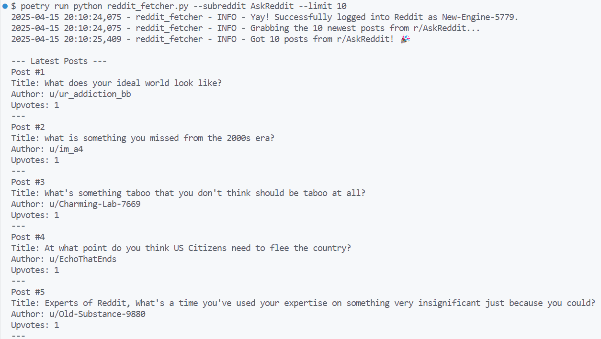

# Reddit Post Fetcher

I put together this app to show some of my skills as a Social Media Automation Engineer.

It currently fetches posts from Reddit, but the core ideas – connecting to platforms, dealing with things like rate limits and logins, and building the API and frontend – are all relevant for automating interactions on sites like Twitter too.

It started as a small API project but grew into this full-stack example.




## What's Inside? 📋

1. [How This Relates to Social Media Automation](#how-this-relates-to-social-media-automation)
2. [Project Structure](#project-structure)
3. [Key Features](#key-features)
4. [Code Highlights](#code-highlights)
5. [API Challenges Tackled](#api-challenges-tackled)
6. [Setup & Usage](#setup--usage)
7. [Future Possibilities](#future-possibilities)
8. [Q&A For Automation Roles](#qa-for-automation-roles)

## How This Relates to Social Media Automation

Even though this project uses Reddit, it shows I can handle the kinds of tasks needed for automating social media on platforms like Twitter:

The Python module (`reddit_fetcher.py`) talks to the Reddit API. This shows I know how to work with social media APIs, handle authentication, and make requests using libraries like asyncpraw (similar skills needed for tweepy, httpx, etc.).

The FastAPI backend (`api_server.py`) creates API endpoints. This proves I can build API services to support automation tools.

The Next.js/TypeScript interface displays the data, showing I'm comfortable with basic JS/HTML.

More specifically, this project shows I have experience with:

- Handling API authentication for social platforms
- Using **asynchronous code** (asyncio)
- Dealing with **rate limits**
- Writing solid **error handling**
- Plugging in **AI services** (like OpenAI in `ai_services.py` for summaries)
- Clear **logging** and organized code, which makes debugging much easier

### Additional Related Experience

While this project focuses primarily on fetching and displaying content, I also have direct experience with **advanced media handling and content creation** through my other project, [reddit-hole](https://github.com/nssharmaofficial/reddit-hole), which demonstrates:

- **Automated video generation** from Reddit content (both long-form videos and shorts)
- **Media processing pipelines** for screenshot capture and video editing
- **Text-to-Speech integration** using AWS Polly for narration
- **Video captioning and visual styling** capabilities
- **Multi-platform content optimization** for different video formats

These skills are directly applicable to the media upload processing (MP4, MOV) requirements mentioned in the job description and show my experience working with media files in Python.

## Project Structure

Here's how everything fits together:

```text
reddit-post-fetcher/
├── reddit_fetcher.py           # Core API interaction module (Python, Asyncio)
├── api_server.py               # FastAPI server (Python, REST API)
├── ai_services.py              # AI integration module (OpenAI API)
├── pyproject.toml              # Python dependencies (Poetry)
├── frontend/                   # Next.js frontend (TypeScript, React)
│   ├── src/                    # Source code
│   │   ├── app/                # Pages and routes
│   │   ├── components/         # React components
│   │   └── lib/                # Utility functions
│   ├── public/                 # Static assets
│   └── package.json            # Frontend dependencies
├── .env.example                # Environment variable configuration
└── README.md                   # Documentation
```

### Core Components

#### 1. `reddit_fetcher.py` (The Reddit Connector)

This is the main Python part that talks directly to Reddit.

#### 2. `api_server.py` (The Backend API)

This uses FastAPI to create the backend API.

#### 3. `ai_services.py` (The AI Module)

This connects to OpenAI's API to create TL;DR summaries of posts.

#### 4. Frontend (The User Interface)

This is the web interface built with Next.js/TypeScript.

## Setup & Usage

### Prerequisites

- Python 3.10+ (for the asyncio features and type hints)
- Node.js 18+ (for the frontend)
- Reddit API credentials (sign up at <https://www.reddit.com/prefs/apps>)
    Go to [Reddit App Preferences](https://www.reddit.com/prefs/apps) and click on create another app at the bottom.
  - Fill out the required details, make sure to select **script** and click on create app.
  - Make a note of the **personal use script** and  **secret token**
- OpenAI API key (for AI summaries)

### Installation

1. **Clone the repository**

    ```bash
    git clone https://github.com/nssharmaofficial/reddit-post-fetcher.git
    cd reddit-post-fetcher
    ```

2. **Set up the Python environment**

    ```bash
    poetry install
    ```

3. **Set up your environment variables**

    ```bash
    # Copy the example and edit with your credentials
    cp .env.example .env

    # Edit .env with your credentials:
    # REDDIT_CLIENT_ID=your_client_id
    # REDDIT_CLIENT_SECRET=your_client_secret
    # REDDIT_USERNAME=your_username
    # REDDIT_PASSWORD=your_password
    # REDDIT_USER_AGENT="python:reddit-fetcher:v1.0.0 (by /u/your_username)"
    # OPENAI_API_KEY=your_openai_api_key
    ```

4. **Set up the frontend**

```bash
cd frontend
npm install
```

### Using the App

You can use the application in different ways:

#### Command Line

```bash
# Get 5 posts from r/python (default)
poetry run python reddit_fetcher.py

# Or customize it
poetry run python reddit_fetcher.py --subreddit AskReddit --limit 10
```

#### API Server

```bash
# Start the FastAPI server
poetry run python api_server.py
```

This gives you these endpoints (available at <http://localhost:8000>):

| Endpoint | What it does | Parameters | Notes |
|----------|----------|------------|-------|
| /api/posts/{subreddit} | Get posts | limit (1-25), force_refresh (bool), use_ai (bool) | Core data retrieval |
| /api/search/subreddits | Search subreddits | query, limit (1-25) | Platform search example |
| /api/ai/enhance/{post_id} | Add AI summary to a post | title, text | Uses ai_services.py |

#### Web Interface

```bash
cd frontend
npm run dev
```

Then visit <http://localhost:3000> to browse posts with a nice UI.

## About AI And This Project

I think it's important to be honest - I used AI to help build parts of this project, especially for the initial code structure and some boilerplate. As someone applying for a Social Media Automation job, I believe using the right tools to work smarter is essential. I see AI as a partner that helps me be more productive, just like automation tools help social media teams work more efficiently.

But the project architecture, API handling patterns, and specific features were all designed by me based on my understanding of what makes a good automation system. The choices around async programming, rate limiting strategies, and error handling reflect my real experience with these problems.

## Why I'd Be Great For This Role

This project shows I go the extra mile - I didn't just create a basic app, but built an MVP full-stack solution.

I'm honest about using AI as a tool (just mentioned above), which shows I value transparency. In a role where trust is important, I believe being straightforward about tools and methods matters.

Most importantly, I understand automation isn't just about making things happen automatically - it's about making them happen reliably, efficiently, and in a way that's easy to maintain. That thinking shows throughout this project's design.

---

Built in **2025** as a test project showcasing skills for a Social Media Automation Engineer position at [TheSoul Publishing](https://jointhesoul.com/).

